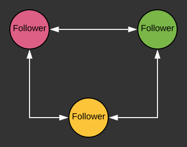

# Build Stateful with fs2, cats-effect

---

## Stateful-ness

```scala
def someApplication(i: Int): Int

someApplication(12) // 20

someApplication(12) // 40

```

---

## Raft Algorithm

Distributed consensus algorithm  

---

#### Leader based algorithm

> All writes go through Leader

nnn

### Inter-process RPC

- Leader election
- Log Replication

nnn

### RPC Life-cycle


nnn

### Correctness guarantee 

* Tolerate node crash
* Tolerate incorrect time
* Tolerate network partition
* Requires persistent storage

---

## Raft Cluster Client Api

```scala
RaftCluster.read();    // return null

RaftCluster.write(20);

RaftCluster.read();   // return 20

```

---

## Cluster Setup



---

## Leader Election

| Initial | Desired |
| ------- | ------- |
|  |  |

---

## Leader election

1. Periodically check if there's leader   
2. Start an election if no leader:
    - Update state to become candidate, and vote for self
    - broadcast VotingRequest

---

**Periodic check (Polling)**

```scala
import cats.effect.Timer
import fs2.Stream

def raftProcess[F[_]: Timer](
  randomTime: F[FiniteDuration]
): Stream[F, Unit] = {
  Stream.repeatEval {
    for {
      wait <- randomTime
      _    <- Timer[F].sleep(wait)
      .... 
    } yield ()
  } 
}
    
```

---

### Vote RPC Phase 1: Initiation

```scala
def voteRPCStart: F[Unit] = {
  for {
    leaderExists   <- checkLeaderExists   
    responses  <- if (!leaderExists) {
                    startElection 
                  } else {
                    F.pure(...) // do nothing 
                  }
       ...
  } yield {}  
}


```

nnn

How to implement **checkLeaderExists**?

```scala

def checkLeaderExists: F[Boolean] = {
  // check some state ...
}

```

nnn

```scala
case class NodeState(
  leader: Option[String]
)

def checkLeaderExists(state: Ref[F, NodeState]): F[Boolean] = {
  for {
    nodeState <- state.get
  } yield {
    nodeState.leader.isDefined  
  }
}
```

nnn

### `Ref`

Functional **var**, model mutable state that can be accessed concurrently

```scala
trait Ref[F[_], A] {
  def get: F[A]
  def update(f: A => A): F[Unit]
}
```

nnn

### Ref is useful for 

```markdown
* Model mutable in-memory state
* Concurrent access to state
* Atomic modification
```

nnn

#### Continue ...

```scala
def voteRPCStart: F[Unit] = {
  for {
    leaderExists   <- checkLeaderExists   
    responses  <- if (!leaderExists) {
                    startElection 
                  } else {
                    F.pure(...) // do nothing 
                  }
       ...
  } yield {}  
}


```

nnn

Let try to implement **startElection**!

```scala
def startElection: F[Unit] = {
  /**
  * 1. Convert to Candidate, vote for self
  * 2. Request Votes from peers
  * 3. Handle response
  */
}
```

nnn

```scala

def startElection(
  selfId: String, 
  voteRequest: VoteRequest,
  state: Ref[F, NodeState]): F[Unit] = {
  for {
    // 1. Convert to Candidate
    _ <- state.update(_.copy(
          tpe = "candidate", votedFor = selfId))
    // 2. Request Votes from peers
    responses <- broadcastVoteRequest(voteRequest)
    
    // 3. Handle response
    _ <- handleResponse(responses)
  } yield {}
}

```

nnn

### Broadcast request


---

## Vote RPC Phase 2: Request Handler 

```scala
def handleVoteRequest(req: VoteRequest): F[VoteResponse] = {
  // 1. Check if requestor is more up-to-date
  // 2. Check if still has vote
  // 3a. If has vote
  //      update vote target, respond with vote granted
  // 3b. If no vote, response with vote rejected
}
``` 

nnn

```scala
def handleVoteRequest(
  req: VoteRequest, 
  state: Ref[F, NodeState]): F[VoteResponse] = {
  for {
    // 1. Check if requestor is more up-to-date
    currentState <- state.get
    isUpToDate = requestorIsUpToDate(req, currentState)
    
    // 2. Check if still has vote
    hasVote = currentState.votedFor.isEmpty
    
    // 3a. If has vote
    //      update vote target, respond with vote granted
    response <- if (isUpToDate && hasVote) {
       state.set(currentState.copy(votedFor = Some(req.nodeId)))
       .as(voteGrantedResponse)
    } else {
    // 3b. If no vote, response with vote rejected
      voteRejectedResponse.pure[F]
    }
  } yield {
    response // this will be send back to requestor   
  }
}
```

nnn

### Atomicity

```scala
for {
  state <- readSomeState
  condition = someConditionBranching
  result <- if (condition) {
                resultA
            } else {
                resultB
            }
} yield result
```

nnn


nnn

### Solution: Locking!

```scala
for {
  _     <- grabLock
  state <- readSomeState
  condition = someConditionBranching
  result <- if (condition) {
                mutateStateA
            } else {
                mutateStateB
            }
  _     <- releaseLock
} yield result
```

### Meet MVar!

```scala
trait MVar[F[_], A] {
  // block until there's a value
  def take: F[A]
  
  // block until it is empty
  def put(a: A): F[Unit]
}
```

nnn

#### This time with Locking

```scala
def handleVoteRequest(
  req: VoteRequest, 
  state: Ref[F, NodeState],
  lock: MVar[F, Unit]): F[VoteResponse] = {
  for {
    // 1. Check if requestor is more up-to-date
    _            <- lock.take
    currentState <- state.get
    isUpToDate = requestorIsUpToDate(req, currentState)
    
    // 2. Check if still has vote
    hasVote = currentState.votedFor.isEmpty
    
    // 3a. If has vote
    //      update vote target, respond with vote granted
    response <- if (isUpToDate && hasVote) {
       state.set(currentState.copy(votedFor = Some(req.nodeId)))
       .as(voteGrantedResponse)
    } else {
    // 3b. If no vote, response with vote rejected
      voteRejectedResponse.pure[F]
    }
    _ <- lock.put(())
  } yield {
    response // this will be send back to requestor   
  }
}
```

nnn


nnn


nnn

### Use MVar for

* Mutual Exclusion 
* Can cause dead-lock
* Do not use to lock operation with unbounded time

nnn

### Important mention: Deferred + Ref

---

## Vote RPC Phase 3: Sender Completion

Reminder

```scala
def startElection(
  selfId: String, 
  voteRequest: VoteRequest,
  state: Ref[F, NodeState]): F[Unit] = {
  for {
    // 1. Convert to Candidate
    _ <- state.update(_.copy(
          tpe = "candidate", votedFor = selfId))
    // 2. Request Votes from peers
    responses <- broadcastVoteRequest(voteRequest)
    
    // 3. Handle response
    _ <- countVote(responses)
  } yield {}
}

```

nnn

### This approach does not work

```scala
for {
    .....
    // 2. Request Votes from peers
    responses <- broadcastVoteRequest(voteRequest)
    
    // 3. Handle response
    _ <- countVote(responses)
} yield {}
```

`broadcastVoteRequest` only returns after getting all responses, so much for availability

nnn


nnn

### Solution: Decouple all the links


show that each links can finish independently

nnn

### Approach 1: Fire and forget (Callback style)

```scala
def startElection(
  selfId: String, 
  voteRequest: VoteRequest,
  state: Ref[F, NodeState]): F[Unit] = {
  for {
    // 1. Convert to Candidate
    _ <- state.update(_.copy(
          tpe = "candidate", votedFor = selfId))
    // 2. Request Votes from peers and handle 
    _ <-  sendRequestAndCountVote(voteRequest)
  } yield {}
}
```

nnn

```scala
def sendRequestAndCountVote(voteRequest: VoteRequest, remotePeers: List[InetAddress]): F[Unit] = {
  val startedProcesses = 
    remotePeers.traverse { peer =>
      val singlePeerTask: F[Unit] = 
        for {
          res <- sendReq(peer, voteRequest)
          _   <- countVote(res)
        } yield {}
        
      singlePeerTask.start 
    }
    
  startedProcesses.map(_ => ())
}
```

nnn

## Meet Concurrent & Fiber ~

```scala
trait Concurrent[F[_]] {
  def start[A](fa: F[A]): F[Fiber[F, A]]
}

trait Fiber[F[_], A] {
  def join: F[A]
  def cancel: F[Unit]
}

```

nnn


