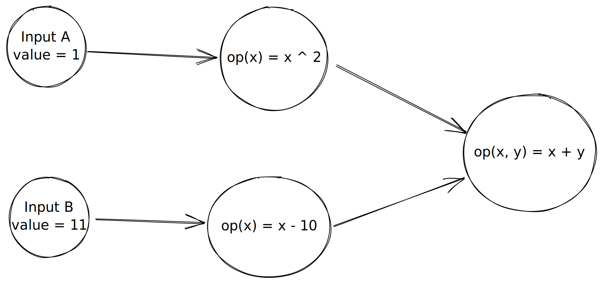

# Overview

I've spent the past few months implementing https://github.com/qingwei91/inc-scala. It mainly copies idea from https://github.com/janestreet/incremental.

I thought I'd write down the way it works here for future reference.

# The problem

Think about spreadsheet, where you can define values in terms of other values using expressions, for example say Cell A1 = MAX(Cell A2: Cell C3). Then everytime a cell changes, we need to update other cells that depends on it. 

We want to only recompute the absolute minimum (or at least close to), this problem is sometimes called Incremental Computing. Essentially if we express a computation as a graph from Input to output, then if only a subset of input changes, we should only recompute the necessary path and keep the rest the same, thus reducing unnecessary compute.

# High level design

We can break this solution into 2 phases:

## The graph building phase

Before doing any interesting computation, we need to build a graph, more precisely a Directed Acyclic Graph that describes our computation.

I opted for a Monadic API, one can create an Input node using `Inc.init(???)` then you can use functions that exists on Monad to compose further. Below is an example of expressing quadratic factoring:

```scala
    import io.incremental._

    val a = Inc.init(1.0)
    val b = Inc.init(0.1)
    val c = Inc.init(-2.0)

    val fourAc: Inc[Double] = a.map2(c, (a, c) => 4 * a * c)
    val sqrtB: Inc[Double]  = b.map2(fourAc, (b, fac) => math.sqrt((b * b) - fac))
    val plusSolution        = b.map2(sqrtB, (b, sqC) => -b + sqC).map2(a, (top, a) => top / (2 * a))
    val minusSolution       = b.map2(sqrtB, (b, sqC) => -b - sqC).map2(a, (top, a) => top / (2 * a))

```

After building a `Inc[T]` tree representing the computation, we need to register it to a Stateful Graph so that it can be evaluated:

```scala
val graph = StateGraph.init
graph.addInc(algorithm)
```

The addInc method will register the whole tree in the graph, and allow us to update certain input and get data from any point in the node.

## The evaluation phase
Once we have our computation represented as a DAG, we need to evaluate the computation encoded within.



Inside the StateGraph, every node in the Inc tree is transformed into an InternalNode in the graph.

There are a few rules being applied to these internal node:
1. Each node can produce 1 value, either by evaluating a computation or by getting data from external world.
1. Each node has dependencies, the dependencies are static, ie. once you define node A depends on node B, it cannot change.
1. Each node can be depended by any number of node, for example, node A can be depend by node B, C, D, E. In other word, node can be reused within a compute graph.
1. Node's dependees are dynamic, ie. they can change over time during computation.
1. A node only recompute if its dependencies recompute.

The nodes are arranged in a way that encodes dependency as order, such that if Node A depends on Node B, then node B will be proceessed 1st. This can be normally be achieved using topology sort, but in this implementation, we followed Jane Street's implementation that only produce a partial order which is more performant.

It is done by computing height of each nodes, and then put them on a matrix-like data structure, where each row index correspond to a height. The evaluation loop just walk through matrix and compute each node when needed.


# Tricky bits
This section documents some challenges I faced when implementing it.

## Dynamic node

Most of the difficulty when implementing this library, comes from the need to support dynamic node. Dynamic node(s) are supported by using FlatMap operator, essentially the graph can decide to dynamically produce inner graph, this inner graph can be a newly instantiated graph, or an existing sub-graph.

After a few iterations, I settled on a design that models FlatMap as a special type of node that is composed of 3 parts:

1. The FlatMap node itself, represent ability to dynamically generate nodes based on input.
1. An inner node, that is generated on the fly, based on function provided when constructing the graph
1. An output node, this node always depends on the inner node

This structure allows us to maintain our invariant about dependencies, which says that dependencies are static, ie. once we declare a node to depends on another node, this relationship hold for the rest of the lifetime of the graph.

In this case, it means when a node depends on a FlatMap node, it actually depends on its output node, decoupled from the dynamic-ism of the inner node. This is important as it allows us to not having to update this field, it is immutable.

## Height computation

Dynamic node also gives other problems, a prominent one is the need of dynamic node, an inner node's height can change dynamically, this has an impact to our evalutation loop, because we need to compute nodes in the right order based on height.

In my 1st implementation, I implemented height as function of dependencies height, the rule is as that a node's height is the maximum height of its dependencies + 1.

While this is conceptually true, and easy to implement, it is not very efficient, because we call this height method all the time, the cost of this computation adds up. We dont really need to make it fully dynamic, in most cases, height never change, and when they do, we actually know about it, and we can update it.

The final implementation basically just store heights as a variable, and update them in the evaluation loop when needed. This is achieved by tracking all outgoing nodes, so that whenever a node's height changes, we can push the change to outgoing nodes.

This design has 1 downside, is that outgoing nodes is actually mutable, again, due to dynamicism. A newly created inner node might depends on existing node, it might also mean the previously generate tree is not relevant anymore and shouldnt be in any nodes' outgoing nodes. So we have more bookkeeping to do with this design.

## Garbage collection
In the previous section, we already getting a sense of this problem. Yes, its the dynamic node again. When the DAG is generated dynamically, it also means its destroyed dynamically, when a new inner node is created, the previous inner node is not used anymore. If this happen enough times, we will have plenty of nodes stored in our graph that is not used, wasting CPU and Memory.

To properly deal with this, we need to garbage collect them. Note this is not implemented yet, but we have a design for it.

Essentially, we can implement it with Reference Counting, every node tracks no of times its being referenced, and when its no longer being referenced, it is ready to be removed from the graph.

Follow the design we outlined so far, we already have this references info because of the height tracking's need, it is essentially the outgoing node.

Garbage collection is only relevant when dealing with FlatMap node. Whenever a flatmap node evaluates, we know the references might have changed, we should 1st update the reference of the terminal node of the previous inner tree. Note terminal node refers to node with largest height in an Inc tree, in the case of Flatmap's inner node, there is 1 and only 1 such node.

The reference update logic work this way:
1. Given referencing node, and a node being referenced
1. Remove referencing node from the referenced nodes' outgoing node array
1. Then if the referenced node's outgoing node array is empty, remove referenced node from our graph, go back to step 1 using its dependent node

This way, we will recursively update references of all of the previous inner node, and remove nodes that are not referenced anymore.

This might not be the most efficient algorithm, I think there's a few way we can optimize it:

1. We mark nodes as dynamic vs static, a dynamically generated inner node can refer/includes static node, we dont need to reference count on those node, because they are depended by 1 or more static node and is guarantee to live as long as the whole graph.
1. There might be some dynamic nodes that perform a flip-flopping pattern where old nodes might be reused sometime latter, so we can actually keep nodes around for a while instead of immediately removing them.

I also dont like the fact that it has to traverse the inner tree whenever this happens, maybe we can generate a deference handler whenever we generate an inner tree, such that changing the reference is a more efficient, but it will involves creating a closure on the fly, not sure if that's much better than the traversing, will need benchmark.


# References:

* [github incremental](https://opensource.janestreet.com/incremental/)
* [breaking down frp](https://blog.janestreet.com/breaking-down-frp/)
* [How to recalculate a spreadsheet](https://lord.io/spreadsheets/)